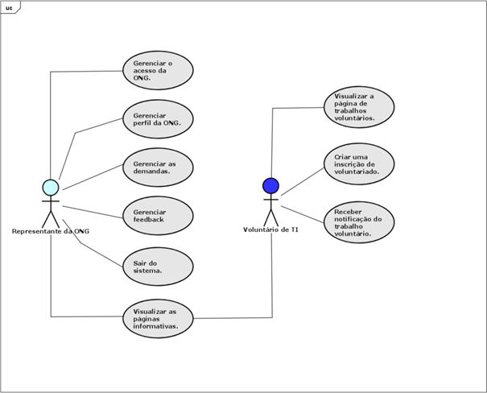

# 3. DOCUMENTO DE ESPECIFICAÇÃO DE REQUISITOS DE SOFTWARE

Nesta parte do trabalho você deve detalhar a documentação dos requisitos do sistema proposto de acordo com as seções a seguir. Ressalta-se que aqui é utilizado como exemplo um sistema de gestão de cursos de aperfeiçoamento.

## 3.1 Objetivos deste documento
Descrever e especificar as necessidades da Coordenação do Curso de Sistemas de Informação da PUC Minas que devem ser atendidas pelo projeto SCCA – Sistema de Cadastro de Cursos de Aperfeiçoamento.

## 3.2 Escopo do produto

### 3.2.1 Nome do produto e seus componentes principais
O produto será denominado SCCA – Sistema de Cadastro de Cursos de Aperfeiçoamento. Ele terá somente um componente (módulo) com os devidos elementos necessários à gestão de cursos.

### 3.2.2 Missão do produto
Gerenciar informações sobre a oferta de cursos de aperfeiçoamento, gerenciar a composição das turmas, alunos, professores e matrículas. 

### 3.2.3 Limites do produto
O SCCA não fornece nenhuma forma de avaliação de alunos, pagamento de parcelas do curso, pagamento a professore e agendamentos. O SCCA não contempla o atendimento a vários cursos de Sistemas de Informação de outras unidades da PUC Minas.

### 3.2.4 Benefícios do produto

| # | Benefício | Valor para o Cliente |
|--------------------|------------------------------------|----------------------------------------|
|1	| Facilidade no cadastro de dados |	Essencial |
|2 | Facilidade na recuperação de informações | Essencial | 
|3 | Segurança no cadastro de matrículas | Essencial | 
|4	| Melhoria na comunicação com os alunos	| Recomendável | 

## 3.3 Descrição geral do produto

### 3.3.1 Requisitos Funcionais

| Código | Requisito Funcional (Funcionalidade)        | Descrição                                                                                                                                                                                                                                                                                            |
|--------|---------------------------------------------|------------------------------------------------------------------------------------------------------------------------------------------------------------------------------------------------------------------------------------------------------------------------------------------------------|
| RF1    | Gerenciar o acesso das ONGs.                | A aplicação deve permitir que as ONGs criem usuário e senha para acessar o sistema. Podendo editar ou excluir as informações de acesso.                                                                                                                                                              |
| RF2    | Gerenciar acesso do voluntário.             | A aplicação deve permitir que os voluntários criem usuário e senha para acessar o sistema. Podendo editar ou excluir as informações de acesso. Além disso, é possível selecionar uma ou mais categorias favoritas para receber notificação caso uma nova demanda seja criada dentro dessa categorias |
| RF3    | Gerenciar acesso do patrocinador.           | A aplicação deve permitir que os patrocinadores criem usuário e senha para acessar o sistema. Podendo editar ou excluir as informações de acesso.                                                                                                                                                    |
| RF4    | Gerenciar perfil das ONGs.                  | A aplicação deve permitir que as ONGs criem, visualizem, editem e excluem informações do perfil.                                                                                                                                                                                                     |
| RF5    | Gerenciar perfil do voluntário.             | A aplicação deve permitir que os voluntários criem, visualizem, editem e excluem informações do perfil.                                                                                                                                                                                              |
| RF6    | Gerenciar perfil do patrocinador.           | A aplicação deve permitir que os patrocinadores criem, visualizem, editem e excluem informações do perfil.                                                                                                                                                                                           |
| RF7    | Gerenciar as demandas.                      | A aplicação deve permitir que as ONGs criem, visualizem, editem ou excluem informações sobre as demandas.                                                                                                                                                                                            |
| RF8    | Gerenciar feedback.                         | A aplicação deve permitir que as ONGs criem solicitações de feedback aos voluntários e visualizem os depoimentos em seus perfis.                                                                                                                                                                     |
| RF9    | Gerenciar trabalhos voluntários.            | O sistema deve permitir que o voluntário visualize a lista de oportunidades de trabalho voluntário que se candidatou, incluindo a descrição da vaga e localização. Também sendo possível desistir de uma demanda candidatada.                                                                        |
| RF10   | Gerenciar patrocínios.                      | A aplicação deve permitir que as ONGs gerenciem os patrocínios recebidos e que os patrocinadores possam se conectar com as ONGs.                                                                                                                                                                     |
| RF11   | Gerenciar conteúdo de páginas informativas. | A aplicação deve consumir o conteúdo das páginas informativas através de uma requisição HTTP ao banco de dados.                                                                                                                                                                                      |
| RF12   | Enviar notificação do trabalho voluntário.  | A aplicação deve enviar uma notificação quando uma ONG expressa interesse em seu perfil.                                                                                                                                                                                                             |
| RF13   | Enviar recomendação de demanda.             | A aplicação deve enviar uma notificação ao voluntário caso uma demanda com categoria favoritada por ele seja criada.                                                                                                                                                                                 |
| RF14   | Sair do sistema.                            | A aplicação deve permitir que os usuários saiam do sistema.                                                                                                                                                                                                                                          |

### 3.3.2 Requisitos Não Funcionais

| Código | Requisito Não Funcional (Restrição)                                                                                                                            |
|--------|----------------------------------------------------------------------------------------------------------------------------------------------------------------|
| RNF1   | O sistema deve oferecer uma interface com design responsivo que se adapte aos dispositivos móveis e desktops.	                                                 |
| RNF2   | As senhas dos usuários devem ser criptografadas antes de serem armazenadas no banco de dados.	                                                                 |
| RNF3   | O sistema deve fornecer feedback visual claro para ações do usuário, como confirmações de envio e mensagens de erro.                                           |
| RFN4   | O sistema deve ser capaz de ser executado nas versões mais recentes dos principais navegadores do mercado, como: Chrome, Firefox, Edge e Safari.               |
| RNF5   | O sistema deve ter um tempo de resposta inferior a 3 segundos, como processamento de formulários e buscas.                                                     |
| RNF6   | O sistema deve ter um tempo de resposta inferior a 5 segundos para a renderização de páginas e navegação geral, para assegurar uma boa experiência do usuário. |
| RNF7   | O sistema deve ter um design modular que facilite a adição de novos recursos e funcionalidades sem a necessidade de reescrever código existente.               |

### 3.3.3 Usuários 

| Ator | Descrição |
|--------------------|------------------------------------|
| Representante da ONG |	Usuário que representa uma ONG e busca suporte técnico ou colaboração em projetos tecnológicos. É responsável por criar e gerenciar solicitações de suporte, acompanhar o progresso dos projetos e assegurar que as necessidades tecnológicas da ONG sejam atendidas. |
| Voluntário de TI |	Usuário que oferece suas habilidades e conhecimentos em tecnologia para apoiar as ONGs. Pode se inscrever em projetos, fornecer suporte técnico, desenvolver soluções para desafios específicos das ONGs, e compartilhar feedback sobre sua experiência por meio de depoimentos. | 

## 3.4 Modelagem do Sistema

### 3.4.1 Diagrama de Casos de Uso
Como observado no diagrama de casos de uso da Figura 1, o representante da ONG poderá gerenciar o acesso na plataforma, gerenciar seu perfil, gerenciar as demandas e gerenciar os feedbacks dos voluntários. O voluntário poderá visualizar a página de trabalhos voluntários, criar uma solicitação de trabalho voluntário e ser notifcado sobre sua inscrição. As páginas informativas pode ser acessada por todos os usuários.

#### Figura 1: Diagrama de Casos de Uso do Sistema.

 
### 3.4.2 Descrições de Casos de Uso

Cada caso de uso deve ter a sua descrição representada nesta seção. Exemplo:

#### Gerenciar Professor (CSU01)

Sumário: A Secretária realiza a gestão (inclusão, remoção, alteração e consulta) dos dados sobre professores.

Ator Primário: Secretária.

Ator Secundário: Coordenador.

Pré-condições: A Secretária deve ser validada pelo Sistema.

Fluxo Principal:

1) 	A Secretária requisita manutenção de professores.
2) 	O Sistema apresenta as operações que podem ser realizadas: inclusão de um novo professor, alteração de um professor, a exclusão de um professor e a consulta de dados de um professor.
3) 	A Secretária seleciona a operação desejada: Inclusão, Exclusão, Alteração ou Consulta, ou opta por finalizar o caso de uso.
4) 	Se a Secretária desejar continuar com a gestão de professores, o caso de uso retorna ao passo 2; caso contrário o caso de uso termina.

Fluxo Alternativo (3): Inclusão

a)	A Secretária requisita a inclusão de um professor.  
b)	O Sistema apresenta uma janela solicitando o CPF do professor a ser cadastrado.  
c)	A Secretária fornece o dado solicitado.  
d)	O Sistema verifica se o professor já está cadastrado. Se sim, o Sistema reporta o fato e volta ao início; caso contrário, apresenta um formulário em branco para que os detalhes do professor (Código, Nome, Endereço, CEP, Estado, Cidade, Bairro, Telefone, Identidade, Sexo, Fax, CPF, Data do Cadastro e Observação) sejam incluídos.  
e)	A Secretária fornece os detalhes do novo professor.  
f)	O Sistema verifica a validade dos dados. Se os dados forem válidos, inclui o novo professor e a grade listando os professores cadastrados é atualizada; caso contrário, o Sistema reporta o fato, solicita novos dados e repete a verificação.  

Fluxo Alternativo (3): Remoção

a)	A Secretária seleciona um professor e requisita ao Sistema que o remova.  
b)	Se o professor pode ser removido, o Sistema realiza a remoção; caso contrário, o Sistema reporta o fato.  

Fluxo Alternativo (3): Alteração

a)	A Secretária altera um ou mais dos detalhes do professor e requisita sua atualização.  
b)	O Sistema verifica a validade dos dados e, se eles forem válidos, altera os dados na lista de professores, caso contrário, o erro é reportado.  
 
Fluxo Alternativo (3): Consulta

a)	A Secretária opta por pesquisar pelo nome ou código e solicita a consulta sobre a lista de professores.  
b)	O Sistema apresenta uma lista professores.  
c)	A Secretária seleciona o professor.  
d)	O Sistema apresenta os detalhes do professor no formulário de professores.  

Pós-condições: Um professor foi inserido ou removido, seus dados foram alterados ou apresentados na tela.

### 3.4.3 Diagrama de Classes 

A Figura 2 mostra o diagrama de classes do sistema. A Matrícula deve conter a identificação do funcionário responsável pelo registro, bem com os dados do aluno e turmas. Para uma disciplina podemos ter diversas turmas, mas apenas um professor responsável por ela.

#### Figura 2: Diagrama de Classes do Sistema.
 

### 3.4.4 Descrições das Classes 

| # | Nome | Descrição |
|--------------------|------------------------------------|----------------------------------------|
| 1	|	Aluno |	Cadastro de informações relativas aos alunos. |
| 2	| Curso |	Cadastro geral de cursos de aperfeiçoamento. |
| 3 |	Matrícula |	Cadastro de Matrículas de alunos nos cursos. |
| 4 |	Turma |	Cadastro de turmas.
| 5	|	Professor |	Cadastro geral de professores que ministram as disciplinas. |
| ... |	... |	... |
