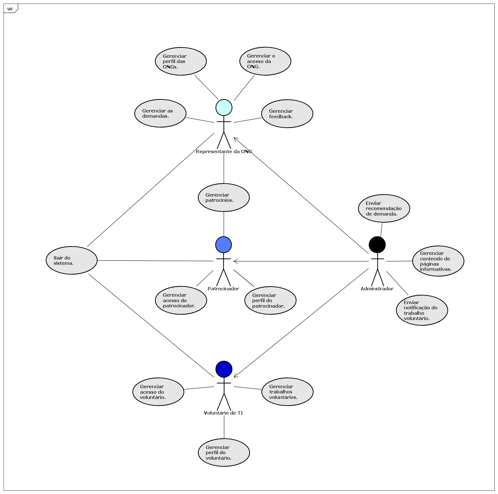
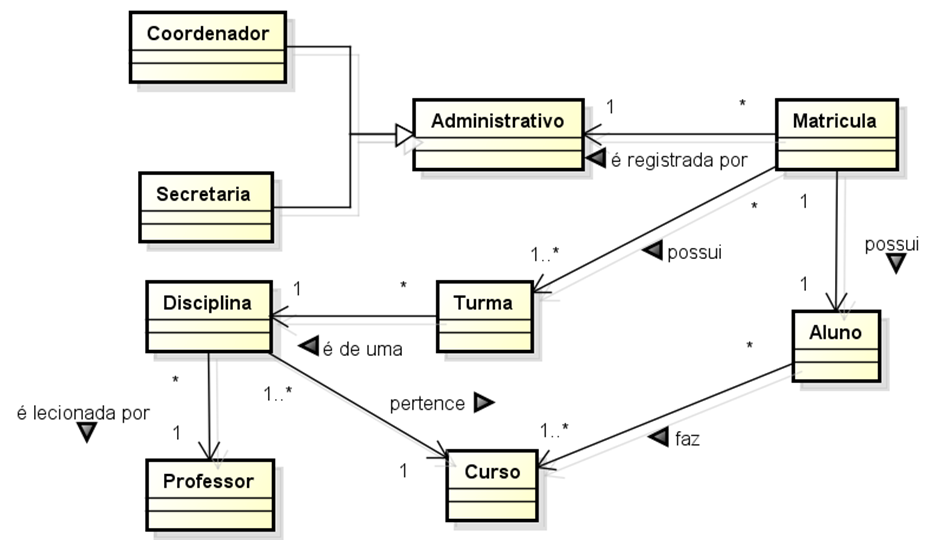

# 3. DOCUMENTO DE ESPECIFICAÇÃO DE REQUISITOS DE SOFTWARE

Neste documento você verá documentação dos requisitos do sistema Conecta.

## 3.1 Objetivos deste documento
Descrever e especificar as necessidades para o desenvolvimento do sistema web que facilitará a conexão entre ONGs e voluntários.

## 3.2 Escopo do produto

### 3.2.1 Nome do produto e seus componentes principais
O produto será denominado SCCA – Sistema de Cadastro de Cursos de Aperfeiçoamento. Ele terá somente um componente (módulo) com os devidos elementos necessários à gestão de cursos.

### 3.2.2 Missão do produto
Gerenciar informações sobre a oferta de cursos de aperfeiçoamento, gerenciar a composição das turmas, alunos, professores e matrículas. 

### 3.2.3 Limites do produto
O SCCA não fornece nenhuma forma de avaliação de alunos, pagamento de parcelas do curso, pagamento a professore e agendamentos. O SCCA não contempla o atendimento a vários cursos de Sistemas de Informação de outras unidades da PUC Minas.

### 3.2.4 Benefícios do produto

| #  | Benefício                                         | Valor para o Cliente |
|----|---------------------------------------------------|----------------------|
| 1  | Facilidade no cadastro e gerenciamento de demandas tecnológicas                | Essencial            |
| 2  | Facilidade na comunicação entre ONGs e voluntários | Essencial            |
| 5  | Facilidade em consultar demandas disponíveis         |Essencial            |
| 5  | Facilidade ao se candidatar a demandas         |Essencial            |
| 3  | Segurança no acesso e compartilhamento de dados    | Essencial            |
| 4  | Interface intuitiva e responsiva para dispositivos móveis e desktop | Essencial |
| 6  | Notificações automáticas sobre novas oportunidades | Recomendável         |
| 7  | Acesso rápido a histórico de colaborações          | Recomendável         |

## 3.3 Descrição geral do produto

### 3.3.1 Requisitos Funcionais

| Código | Requisito Funcional (Funcionalidade)        | Descrição                                                                                                                        |
|--------|---------------------------------------------|-----------------------------------------------------------------------------------------------------------------------------------------------------------------------------------------------------------------------------|
| RF1 | Gerenciar o acesso das ONGs. | A aplicação deve permitir que as ONGs criem usuário e senha para acessar o sistema. Podendo editar ou excluir as informações de acesso.  |
| RF2 | Gerenciar acesso do voluntário. | A aplicação deve permitir que os voluntários criem usuário e senha para acessar o sistema. Podendo editar ou excluir as informações de acesso. Além disso, é possível selecionar uma ou mais categorias favoritas para receber notificação caso uma nova demanda seja criada dentro dessa categorias. |
| RF3 | Gerenciar acesso do patrocinador. | A aplicação deve permitir que os patrocinadores criem usuário e senha para acessar o sistema. Podendo editar ou excluir as informações de acesso. |
| RF4 | Gerenciar perfil das ONGs. | A aplicação deve permitir que as ONGs criem, visualizem, editem e excluem informações do perfil. |
| RF5 | Gerenciar perfil do voluntário. | A aplicação deve permitir que os voluntários criem, visualizem, editem e excluem informações do perfil. |
| RF6 | Gerenciar perfil do patrocinador. | A aplicação deve permitir que os patrocinadores criem, visualizem, editem e excluem informações do perfil. |
| RF7 | Gerenciar as demandas. | A aplicação deve permitir que as ONGs criem, visualizem, editem ou excluem informações sobre as demandas. |
| RF8 | Gerenciar feedback. | A aplicação deve permitir que as ONGs criem solicitações de feedback aos voluntários e visualizem os depoimentos em seus perfis. |
| RF9 | Gerenciar trabalhos voluntários. | O sistema deve permitir que o voluntário visualize a lista de oportunidades de trabalho voluntário que se candidatou, incluindo a descrição da vaga e localização. Também sendo possível desistir de uma demanda candidatada. |
| RF10 | Gerenciar patrocínios. | A aplicação deve permitir que as ONGs gerenciem os patrocínios recebidos e que os patrocinadores possam se conectar com as ONGs. |
| RF11 | Gerenciar conteúdo de páginas informativas. | A aplicação deve consumir o conteúdo das páginas informativas através de uma requisição HTTP ao banco de dados. |
| RF12 | Enviar notificação do trabalho voluntário.  | A aplicação deve enviar uma notificação quando uma ONG expressa interesse em seu perfil. |
| RF13 | Enviar recomendação de demanda. | A aplicação deve enviar uma notificação ao voluntário caso uma demanda com categoria favoritada por ele seja criada. |
| RF14 | Sair do sistema. | A aplicação deve permitir que os usuários saiam do sistema. |

### 3.3.2 Requisitos Não Funcionais

| Código | Requisito Não Funcional (Restrição)                                                                                                                            |
|--------|----------------------------------------------------------------------------------------------------------------------------------------------------------------|
| RNF1   | O sistema deve oferecer uma interface com design responsivo que se adapte aos dispositivos móveis e desktops.	                                                 |
| RNF2   | As senhas dos usuários devem ser criptografadas antes de serem armazenadas no banco de dados.	                                                                 |
| RNF3   | O sistema deve fornecer feedback visual claro para ações do usuário, como confirmações de envio e mensagens de erro.                                           |
| RFN4   | O sistema deve ser capaz de ser executado nas versões mais recentes dos principais navegadores do mercado, como: Chrome, Firefox, Edge e Safari.               |
| RNF5   | O sistema deve ter um tempo de resposta inferior a 3 segundos, como processamento de formulários e buscas.                                                     |
| RNF6   | O sistema deve ter um tempo de resposta inferior a 5 segundos para a renderização de páginas e navegação geral, para assegurar uma boa experiência do usuário. |
| RNF7   | O sistema deve ter um design modular que facilite a adição de novos recursos e funcionalidades sem a necessidade de reescrever código existente.               |

### 3.3.3 Usuários 

| Ator | Descrição |
|--------------------|------------------------------------|
| Representante da ONG |	Usuário que representa uma ONG e busca suporte técnico ou colaboração em projetos tecnológicos. É responsável por criar e gerenciar solicitações de suporte, acompanhar o progresso dos projetos e assegurar que as necessidades tecnológicas da ONG sejam atendidas. |
| Voluntário de TI |	Usuário que oferece suas habilidades e conhecimentos em tecnologia para apoiar as ONGs. Pode se inscrever em projetos, fornecer suporte técnico, desenvolver soluções para desafios específicos das ONGs, e compartilhar feedback sobre sua experiência por meio de depoimentos. |
| Patrocinador | Usuário que pode ser uma entidade ou indivíduo que fornece recursos financeiros ou apoio material para as ONGs e seus projetos. Ele pode ser uma empresa, uma fundação ou um investidor social interessado em promover causas sociais e comunitárias. |
| Adminstrador | Usuário gerente dos sistema. Possui acesso geral do sistema garante a segurança e integridade dos dados. |

## 3.4 Modelagem do Sistema

### 3.4.1 Diagrama de Casos de Uso
Como observado no diagrama de casos de uso da Figura 1, o representante da ONG poderá gerenciar o acesso à plataforma, gerenciar seu perfil, gerenciar as demandas, gerenciar os feedbacks dos voluntários e gerenciar os patrocínios recebidos. O voluntário poderá gerenciar o acesso ao sistema, gerenciar seu perfil e gerenciar os trabalhos voluntários aos quais se candidatou. O patrocinador poderá gerenciar o acesso à aplicação, gerenciar seu perfil e gerenciar os patrocínios. Por fim, o administrador terá acesso geral à plataforma, além de poder enviar recomendações de demandas, gerenciar os conteúdos das páginas informativas e notificar o voluntário sobre trabalhos voluntários.

#### Figura 1: Diagrama de Casos de Uso do Sistema.

 
### 3.4.2 Descrições de Casos de Uso

#### Gerenciar o acesso das ONGs (CSU01) ALICE

**Sumário**: Este caso de uso permite que o representante da ONG gerencie seu acesso na plataforma, incluindo a criação, modificação e exclusão de acesso. O objetivo principal é garantir que o representante da ONG tenha controle sobre suas informações dentro do sistema.

**Ator Primário**: Representante da ONG.

**Ator Secundário**: Administrador.

**Pré-condições**: Não exsitem.

**Fluxo Principal**: Cadastro da ONG.

1)  O representante da ONG acessa a página de login do sistema.
2)  Insere seus dados.
3)  O sistema valida os dados fornecidos.
3)  O cadastro da ONG é criado.
4)  O representante da ONG acessa o sistema.

**Fluxo Alternativo**: Alteração de senha.

a)  O representante da ONG acessa a página de editar perfil.  
b)  Seleciona a opção de alterar senha.  
c)  Insere a senha atual e a nova senha. 
d)  A senha do representante da ONG é alterada. 

**Fluxo Alternativo**: Exclusão de acesso.

a)  O representante da ONG acessa a página de editar perfil.  
b)  Seleciona a opção de excluir conta.  
c)  Confirma a exclusão.  
d)  Conta do representante da ONG é excluída do sistema.  

**Pós-condições**: Conta do representante da ONG deve existir ou ser excluída.

#### Gerenciar acesso do voluntário (CSU02) GABRIEL

**Sumário**: Um breve resumo do que o caso de uso faz e qual o seu objetivo principal.

**Ator Primário**: Adicione o ator principal.

**Ator Secundário**: Adicione o ator secundário.

**Pré-condições**: Condições que devem ser atendidas antes que o caso de uso possa ser executado.

**Fluxo Principal**:

1)  Coloque aqui o fluxo.
2)  Coloque aqui o fluxo.
3)  Coloque aqui o fluxo.
4)  Coloque aqui o fluxo...

**Fluxo Alternativo**: Coloque aqui o nome fluxo alternativo caso houver.

a)  Descreva o fluxo alternativo caso houver.  
b)  Descreva o fluxo alternativo caso houver.  
c)  Descreva o fluxo alternativo caso houver...  

**Fluxo Alternativo**: Coloque aqui o nome fluxo alternativo caso houver.

a)  Descreva o fluxo alternativo caso houver.  
b)  Descreva o fluxo alternativo caso houver.  
c)  Descreva o fluxo alternativo caso houver...  

**Pós-condições**: O que deve ser verdade depois que o caso de uso é concluído com sucesso.

#### Gerenciar acesso do voluntário (CSU02)

**Sumário**: Este caso de uso permite que o voluntário gerencie seu acesso ao sistema, incluindo a criação, modificação e exclusão de acesso. O objetivo principal é garantir que o voluntário tenha controle sobre suas informações dentro da plataforma.

**Ator Primário**: Voluntário.

**Ator Secundário**: Administrador.

**Pré-condições**: Não existem.

**Fluxo Principal**: Cadastro de voluntário.

1) 	Voluntário acessa a página de cadastro.
2) 	Insere seus dados.
3) 	O cadastro do voluntário é criado.
4) 	O voluntário se loga no sistema.

**Fluxo Alternativo**: Alteração de senha.

a)  Voluntário acessa a página de editar perfil.
b)  Seleciona a opção de alterar senha.
c)  Insere a senha atual e a nova senha.
d)  A senha do voluntário é alterada.

**Fluxo Alternativo**: Exclusão de acesso.

a)	Voluntário acessa a página de editar perfil.
b)	Seleciona a opção de excluir conta.
c)	Confirma a exclusão.
d)	Conta do voluntário é excluída do sistema.

**Pós-condições**: Conta do voluntário deve existir ou ser excluída.

#### Gerenciar acesso do patrocinador (CSU03) OMAR

**Sumário**: Um breve resumo do que o caso de uso faz e qual o seu objetivo principal.

**Ator Primário**: Adicione o ator principal.

**Ator Secundário**: Adicione o ator secundário.

**Pré-condições**: Condições que devem ser atendidas antes que o caso de uso possa ser executado.

**Fluxo Principal**:

1)  Coloque aqui o fluxo.
2)  Coloque aqui o fluxo.
3)  Coloque aqui o fluxo.
4)  Coloque aqui o fluxo...

**Fluxo Alternativo**: Coloque aqui o nome fluxo alternativo caso houver.

a)  Descreva o fluxo alternativo caso houver.  
b)  Descreva o fluxo alternativo caso houver.  
c)  Descreva o fluxo alternativo caso houver...  

**Fluxo Alternativo**: Coloque aqui o nome fluxo alternativo caso houver.

a)  Descreva o fluxo alternativo caso houver.  
b)  Descreva o fluxo alternativo caso houver.  
c)  Descreva o fluxo alternativo caso houver...  

**Pós-condições**: O que deve ser verdade depois que o caso de uso é concluído com sucesso.

#### Gerenciar perfil das ONGs (CSU04) LEONARDO

**Sumário**: Um breve resumo do que o caso de uso faz e qual o seu objetivo principal.

**Ator Primário**: Adicione o ator principal.

**Ator Secundário**: Adicione o ator secundário.

**Pré-condições**: Condições que devem ser atendidas antes que o caso de uso possa ser executado.

**Fluxo Principal**:

1)  Coloque aqui o fluxo.
2)  Coloque aqui o fluxo.
3)  Coloque aqui o fluxo.
4)  Coloque aqui o fluxo...

**Fluxo Alternativo**: Coloque aqui o nome fluxo alternativo caso houver.

a)  Descreva o fluxo alternativo caso houver.  
b)  Descreva o fluxo alternativo caso houver.  
c)  Descreva o fluxo alternativo caso houver...  

**Fluxo Alternativo**: Coloque aqui o nome fluxo alternativo caso houver.

a)  Descreva o fluxo alternativo caso houver.  
b)  Descreva o fluxo alternativo caso houver.  
c)  Descreva o fluxo alternativo caso houver...  

**Pós-condições**: O que deve ser verdade depois que o caso de uso é concluído com sucesso.

#### Gerenciar perfil do voluntário (CSU05) JOÃO

**Sumário**: Um breve resumo do que o caso de uso faz e qual o seu objetivo principal.

**Ator Primário**: Adicione o ator principal.

**Ator Secundário**: Adicione o ator secundário.

**Pré-condições**: Condições que devem ser atendidas antes que o caso de uso possa ser executado.

**Fluxo Principal**:

1)  Coloque aqui o fluxo.
2)  Coloque aqui o fluxo.
3)  Coloque aqui o fluxo.
4)  Coloque aqui o fluxo...

**Fluxo Alternativo**: Coloque aqui o nome fluxo alternativo caso houver.

a)  Descreva o fluxo alternativo caso houver.  
b)  Descreva o fluxo alternativo caso houver.  
c)  Descreva o fluxo alternativo caso houver...  

**Fluxo Alternativo**: Coloque aqui o nome fluxo alternativo caso houver.

a)  Descreva o fluxo alternativo caso houver.  
b)  Descreva o fluxo alternativo caso houver.  
c)  Descreva o fluxo alternativo caso houver...  

**Pós-condições**: O que deve ser verdade depois que o caso de uso é concluído com sucesso.

#### Gerenciar perfil do patrocinador (CSU06) ALICE

**Sumário**: Este caso de uso permite que o patrocinador gerencie as informações do seu perfil no sistema. O objetivo principal é garantir que o patrocinador possa atualizar seus dados de contato, informações da empresa, e acompanhar seu envolvimento em projetos de suporte a ONGs.

**Ator Primário**: Patrocinador.

**Ator Secundário**: Adminstrador.

**Pré-condições**: O patrocinador deve estar cadastrado no sistema com um login e senha válidos.

**Fluxo Principal**: Criar perfil do patrocinador.

1)  O patrocinador faz login no sistema e acessa a área de perfil.
2)  O sistema exibe as informações atuais do perfil do patrocinador.
3)  O patrocinador pode editar as informações de contato, como endereço de e-mail, número de telefone e dados da empresa.
4)  O patrocinador confirma as alterações clicando em "Salvar".
5)  O sistema valida as informações e salva as alterações.

**Fluxo Alternativo**: Edição de dados inválidos.

a)  O patrocinador insere dados inválidos, como um formato de e-mail incorreto ou um número de telefone incompleto.  
b)  O sistema exibe uma mensagem de erro informando quais campos precisam ser corrigidos.  
c)  O patrocinador ajusta as informações e tenta salvar novamente.  

**Pós-condições**: O perfil do patrocinador é atualizado com sucesso no sistema.

#### Gerenciar as demandas (CSU07) DAVIH

**Sumário**: Um breve resumo do que o caso de uso faz e qual o seu objetivo principal.

**Ator Primário**: Adicione o ator principal.

**Ator Secundário**: Adicione o ator secundário.

**Pré-condições**: Condições que devem ser atendidas antes que o caso de uso possa ser executado.

**Fluxo Principal**:

1)  Coloque aqui o fluxo.
2)  Coloque aqui o fluxo.
3)  Coloque aqui o fluxo.
4)  Coloque aqui o fluxo...

**Fluxo Alternativo**: Coloque aqui o nome fluxo alternativo caso houver.

a)  Descreva o fluxo alternativo caso houver.  
b)  Descreva o fluxo alternativo caso houver.  
c)  Descreva o fluxo alternativo caso houver...  

**Fluxo Alternativo**: Coloque aqui o nome fluxo alternativo caso houver.

a)  Descreva o fluxo alternativo caso houver.  
b)  Descreva o fluxo alternativo caso houver.  
c)  Descreva o fluxo alternativo caso houver...  

**Pós-condições**: O que deve ser verdade depois que o caso de uso é concluído com sucesso.

#### Gerenciar feedback (CSU08) GABRIEL

**Sumário**: Um breve resumo do que o caso de uso faz e qual o seu objetivo principal.

**Ator Primário**: Adicione o ator principal.

**Ator Secundário**: Adicione o ator secundário.

**Pré-condições**: Condições que devem ser atendidas antes que o caso de uso possa ser executado.

**Fluxo Principal**:

1)  Coloque aqui o fluxo.
2)  Coloque aqui o fluxo.
3)  Coloque aqui o fluxo.
4)  Coloque aqui o fluxo...

**Fluxo Alternativo**: Coloque aqui o nome fluxo alternativo caso houver.

a)  Descreva o fluxo alternativo caso houver.  
b)  Descreva o fluxo alternativo caso houver.  
c)  Descreva o fluxo alternativo caso houver...  

**Fluxo Alternativo**: Coloque aqui o nome fluxo alternativo caso houver.

a)  Descreva o fluxo alternativo caso houver.  
b)  Descreva o fluxo alternativo caso houver.  
c)  Descreva o fluxo alternativo caso houver...  

**Pós-condições**: O que deve ser verdade depois que o caso de uso é concluído com sucesso.

#### Gerenciar feedback (CSU08)

**Sumário**: Este caso de uso permite que o voluntário envie, visualize e exclua feedbacks relacionados à demandas que participou. O objetivo principal é coletar experiências dos voluntários para incentivar outros voluntários.

**Ator Primário**: Voluntário.

**Ator Secundário**: ONG.

**Pré-condições**: Voluntário deve ter participado de uma demanda que foi finalizada.

**Fluxo Principal**: Envio de feedback.

1) 	ONG solicita feedback do voluntário.
2)  Voluntário recebe e-mail com link para enviar feedback.
3)  Voluntário acessa o link e preenche o formulário.
4)  Feedback é disponibilizado na página da ONG.

**Fluxo Alternativo**: Exclusão de feedback.

a)  Voluntário acessa a página de feedback.
b)  Seleciona o feedback que deseja excluir.
c)  Confirma a exclusão.
d)  Feedback é removido da página.

**Pós-condições**: Feedback deve ser enviado, visualizado ou excluído.

#### Gerenciar trabalhos voluntários (CSU09) DAVIH

**Sumário**: Um breve resumo do que o caso de uso faz e qual o seu objetivo principal.

**Ator Primário**: Adicione o ator principal.

**Ator Secundário**: Adicione o ator secundário.

**Pré-condições**: Condições que devem ser atendidas antes que o caso de uso possa ser executado.

**Fluxo Principal**:

1)  Coloque aqui o fluxo.
2)  Coloque aqui o fluxo.
3)  Coloque aqui o fluxo.
4)  Coloque aqui o fluxo...

**Fluxo Alternativo**: Coloque aqui o nome fluxo alternativo caso houver.

a)  Descreva o fluxo alternativo caso houver.  
b)  Descreva o fluxo alternativo caso houver.  
c)  Descreva o fluxo alternativo caso houver...  

**Fluxo Alternativo**: Coloque aqui o nome fluxo alternativo caso houver.

a)  Descreva o fluxo alternativo caso houver.  
b)  Descreva o fluxo alternativo caso houver.  
c)  Descreva o fluxo alternativo caso houver...  

**Pós-condições**: O que deve ser verdade depois que o caso de uso é concluído com sucesso.

#### Gerenciar patrocínios (CSU010) OMAR

**Sumário**: Um breve resumo do que o caso de uso faz e qual o seu objetivo principal.

**Ator Primário**: Adicione o ator principal.

**Ator Secundário**: Adicione o ator secundário.

**Pré-condições**: Condições que devem ser atendidas antes que o caso de uso possa ser executado.

**Fluxo Principal**:

1)  Coloque aqui o fluxo.
2)  Coloque aqui o fluxo.
3)  Coloque aqui o fluxo.
4)  Coloque aqui o fluxo...

**Fluxo Alternativo**: Coloque aqui o nome fluxo alternativo caso houver.

a)  Descreva o fluxo alternativo caso houver.  
b)  Descreva o fluxo alternativo caso houver.  
c)  Descreva o fluxo alternativo caso houver...  

**Fluxo Alternativo**: Coloque aqui o nome fluxo alternativo caso houver.

a)  Descreva o fluxo alternativo caso houver.  
b)  Descreva o fluxo alternativo caso houver.  
c)  Descreva o fluxo alternativo caso houver...  

**Pós-condições**: O que deve ser verdade depois que o caso de uso é concluído com sucesso.

#### Gerenciar conteúdo de páginas informativas (CSU011) LEONARDO

**Sumário**: Um breve resumo do que o caso de uso faz e qual o seu objetivo principal.

**Ator Primário**: Adicione o ator principal.

**Ator Secundário**: Adicione o ator secundário.

**Pré-condições**: Condições que devem ser atendidas antes que o caso de uso possa ser executado.

**Fluxo Principal**:

1)  Coloque aqui o fluxo.
2)  Coloque aqui o fluxo.
3)  Coloque aqui o fluxo.
4)  Coloque aqui o fluxo...

**Fluxo Alternativo**: Coloque aqui o nome fluxo alternativo caso houver.

a)  Descreva o fluxo alternativo caso houver.  
b)  Descreva o fluxo alternativo caso houver.  
c)  Descreva o fluxo alternativo caso houver...  

**Fluxo Alternativo**: Coloque aqui o nome fluxo alternativo caso houver.

a)  Descreva o fluxo alternativo caso houver.  
b)  Descreva o fluxo alternativo caso houver.  
c)  Descreva o fluxo alternativo caso houver...  

**Pós-condições**: O que deve ser verdade depois que o caso de uso é concluído com sucesso.

#### Enviar notificação do trabalho voluntário (CSU012) JOÃO

**Sumário**: Um breve resumo do que o caso de uso faz e qual o seu objetivo principal.

**Ator Primário**: Adicione o ator principal.

**Ator Secundário**: Adicione o ator secundário.

**Pré-condições**: Condições que devem ser atendidas antes que o caso de uso possa ser executado.

**Fluxo Principal**:

1)  Coloque aqui o fluxo.
2)  Coloque aqui o fluxo.
3)  Coloque aqui o fluxo.
4)  Coloque aqui o fluxo...

**Fluxo Alternativo**: Coloque aqui o nome fluxo alternativo caso houver.

a)  Descreva o fluxo alternativo caso houver.  
b)  Descreva o fluxo alternativo caso houver.  
c)  Descreva o fluxo alternativo caso houver...  

**Fluxo Alternativo**: Coloque aqui o nome fluxo alternativo caso houver.

a)  Descreva o fluxo alternativo caso houver.  
b)  Descreva o fluxo alternativo caso houver.  
c)  Descreva o fluxo alternativo caso houver...  

**Pós-condições**: O que deve ser verdade depois que o caso de uso é concluído com sucesso.

#### Enviar recomendação de demanda (CSU013) DAVIH

**Sumário**: Um breve resumo do que o caso de uso faz e qual o seu objetivo principal.

**Ator Primário**: Adicione o ator principal.

**Ator Secundário**: Adicione o ator secundário.

**Pré-condições**: Condições que devem ser atendidas antes que o caso de uso possa ser executado.

**Fluxo Principal**:

1)  Coloque aqui o fluxo.
2)  Coloque aqui o fluxo.
3)  Coloque aqui o fluxo.
4)  Coloque aqui o fluxo...

**Fluxo Alternativo**: Coloque aqui o nome fluxo alternativo caso houver.

a)  Descreva o fluxo alternativo caso houver.  
b)  Descreva o fluxo alternativo caso houver.  
c)  Descreva o fluxo alternativo caso houver...  

**Fluxo Alternativo**: Coloque aqui o nome fluxo alternativo caso houver.

a)  Descreva o fluxo alternativo caso houver.  
b)  Descreva o fluxo alternativo caso houver.  
c)  Descreva o fluxo alternativo caso houver...  

**Pós-condições**: O que deve ser verdade depois que o caso de uso é concluído com sucesso.

#### Sair do sistema (CSU014) ALICE

**Sumário**: Este caso de uso permite que o usuário saia do sistema de forma segura. O objetivo principal é garantir que as sessões de usuário sejam encerradas adequadamente.

**Ator Primário**: Todos os usuários.

**Ator Secundário**: Nenhum.

**Pré-condições**: O usuário deve estar autenticado no sistema, com uma sessão ativa.

**Fluxo Principal**: Sair da aplicação.

1)  O usuário clica no botão "Sair" disponível no menu do sistema.
2)  O sistema exibe uma mensagem de confirmação perguntando se o usuário deseja realmente sair.
3)  O usuário confirma que deseja sair clicando em "Sim".
4)  O sistema encerra a sessão do usuário e redireciona para a página de login.
5)  O sistema exibe uma mensagem informando que o logout foi realizado com sucesso.

**Fluxo Alternativo**: Cancelar logout.

a)  O usuário clica no botão "Cancelar" após a mensagem de confirmação.  
b)  O sistema mantém a sessão ativa e retorna ao menu principal.  
c)  O usuário continua a interagir com o sistema normalmente.  

**Pós-condições**: A sessão do usuário é encerrada e não pode mais ser acessada até que um novo login seja realizado.

### 3.4.3 Diagrama de Classes 

A Figura 2 mostra o diagrama de classes do sistema. A Matrícula deve conter a identificação do funcionário responsável pelo registro, bem com os dados do aluno e turmas. Para uma disciplina podemos ter diversas turmas, mas apenas um professor responsável por ela.

#### Figura 2: Diagrama de Classes do Sistema.

### 3.4.4 Descrições das Classes 

| # | Nome | Descrição |
|--------------------|------------------------------------|----------------------------------------|
| 1 |   Aluno | Cadastro de informações relativas aos alunos. |
| 2 | Curso |   Cadastro geral de cursos de aperfeiçoamento. |
| 3 |   Matrícula | Cadastro de Matrículas de alunos nos cursos. |
| 4 |   Turma | Cadastro de turmas.
| 5 |   Professor | Cadastro geral de professores que ministram as disciplinas. |
| ... | ... |   ... |
