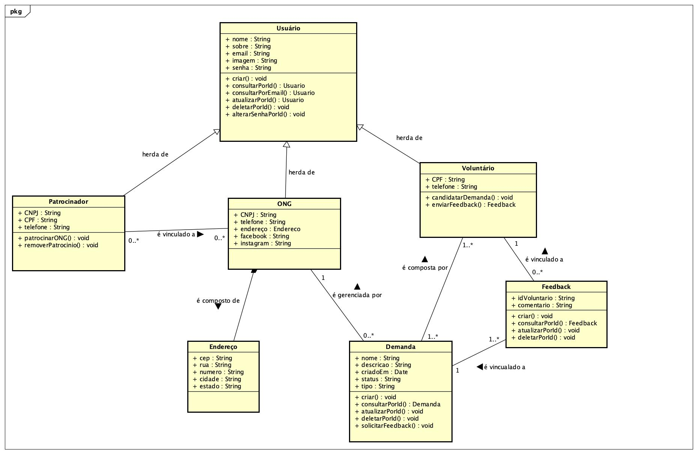

# 3. DOCUMENTO DE ESPECIFICAÇÃO DE REQUISITOS DE SOFTWARE

Neste documento você verá documentação dos requisitos do sistema Conecta.

## 3.1 Objetivos deste documento
Descrever e especificar as necessidades para o desenvolvimento do sistema web que facilitará a conexão entre ONGs e voluntários.

## 3.2 Escopo do produto

### 3.2.1 Nome do produto e seus componentes principais
O Conecta possui os seguintes componentes principais:

* Módulo de Cadastro de ONGs: Permite o registro de organizações não governamentais, incluindo dados como área de atuação, localização, e tipo de atividades que necessitam de voluntários.
* Módulo de Gerenciamento de Demandas: Permite que as ONGs publiquem oportunidades de voluntariado, e voluntários possam se inscrever em atividades específicas.
* Módulo de Cadastro de Voluntários: Permite que profissionais se registrem, informando suas habilidades, interesses e disponibilidade para atividades de voluntariado.
* Módulo de Correspondência: Responsável por conectar ONGs e voluntários com base nas necessidades das ONGs e nas habilidades dos voluntários.

### 3.2.2 Missão do produto
A missão do Conecta é facilitar a conexão entre ONGs e voluntários de tecnologia, fornecendo uma plataforma de fácil utilização, que centraliza as necessidades das ONGs e as habilidades dos voluntários, promovendo o impacto social positivo por meio do voluntariado.

### 3.2.3 Limites do produto
O Conecta não gerencia compensações financeiras para os voluntários, nem o pagamento de atividades remuneradas. Ele também não abrange o gerenciamento completo de projetos ou tarefas internas das ONGs. Além disso, o produto não oferece suporte a ONGs ou voluntários fora do país ou de regiões não cobertas pelo serviço.

### 3.2.4 Benefícios do produto

| #  | Benefício                                         | Valor para o Cliente |
|----|---------------------------------------------------|----------------------|
| 1  | Facilidade no cadastro e gerenciamento de demandas tecnológicas                | Essencial            |
| 2  | Facilidade na comunicação entre ONGs e voluntários | Essencial            |
| 5  | Facilidade em consultar demandas disponíveis         |Essencial            |
| 5  | Facilidade ao se candidatar a demandas         |Essencial            |
| 3  | Segurança no acesso e compartilhamento de dados    | Essencial            |
| 4  | Interface intuitiva e responsiva para dispositivos móveis e desktop | Essencial |
| 6  | Notificações automáticas sobre novas oportunidades | Recomendável         |
| 7  | Acesso rápido a histórico de colaborações          | Recomendável         |

## 3.3 Descrição geral do produto

### 3.3.1 Requisitos Funcionais

| Código | Requisito Funcional (Funcionalidade)        | Descrição                                                                                                                        |
|--------|---------------------------------------------|-----------------------------------------------------------------------------------------------------------------------------------------------------------------------------------------------------------------------------|
| RF1 | Gerenciar o acesso das ONGs. | A aplicação deve permitir que as ONGs criem usuário e senha para acessar o sistema. Podendo editar ou excluir as informações de acesso.  |
| RF2 | Gerenciar acesso do voluntário. | A aplicação deve permitir que os voluntários criem usuário e senha para acessar o sistema. Podendo editar ou excluir as informações de acesso. Além disso, é possível selecionar uma ou mais categorias favoritas para receber notificação caso uma nova demanda seja criada dentro dessa categorias. |
| RF3 | Gerenciar acesso do patrocinador. | A aplicação deve permitir que os patrocinadores criem usuário e senha para acessar o sistema. Podendo editar ou excluir as informações de acesso. |
| RF4 | Gerenciar perfil das ONGs. | A aplicação deve permitir que as ONGs criem, visualizem, editem e excluem informações do perfil. |
| RF5 | Gerenciar perfil do voluntário. | A aplicação deve permitir que os voluntários criem, visualizem, editem e excluem informações do perfil. |
| RF6 | Gerenciar perfil do patrocinador. | A aplicação deve permitir que os patrocinadores criem, visualizem, editem e excluem informações do perfil. |
| RF7 | Gerenciar as demandas. | A aplicação deve permitir que as ONGs criem, visualizem, editem ou excluem informações sobre as demandas. |
| RF8 | Gerenciar feedback. | A aplicação deve permitir que as ONGs criem solicitações de feedback aos voluntários e visualizem os depoimentos em seus perfis. |
| RF9 | Gerenciar trabalhos voluntários. | O sistema deve permitir que o voluntário visualize a lista de oportunidades de trabalho voluntário que se candidatou, incluindo a descrição da vaga e localização. Também sendo possível desistir de uma demanda candidatada. |
| RF10 | Gerenciar patrocínios. | A aplicação deve permitir que as ONGs gerenciem os patrocínios recebidos e que os patrocinadores possam se conectar com as ONGs. |
| RF11 | Gerenciar conteúdo de páginas informativas. | A aplicação deve consumir o conteúdo das páginas informativas através de uma requisição HTTP ao banco de dados. |
| RF12 | Enviar notificação do trabalho voluntário.  | A aplicação deve enviar uma notificação quando uma ONG expressa interesse em seu perfil. |
| RF13 | Enviar recomendação de demanda. | A aplicação deve enviar uma notificação ao voluntário caso uma demanda com categoria favoritada por ele seja criada. |
| RF14 | Entrar no sistema. | A aplicação deve permitir que os usuários façam login do sistema. |
| RF15 | Sair do sistema. | A aplicação deve permitir que os usuários saiam do sistema. |

### 3.3.2 Requisitos Não Funcionais

| Código | Requisito Não Funcional (Restrição)                                                                                                                            |
|--------|----------------------------------------------------------------------------------------------------------------------------------------------------------------|
| RNF1   | O sistema deve oferecer uma interface com design responsivo que se adapte aos dispositivos móveis e desktops.	                                                 |
| RNF2   | As senhas dos usuários devem ser criptografadas antes de serem armazenadas no banco de dados.	                                                                 |
| RNF3   | O sistema deve fornecer feedback visual claro para ações do usuário, como confirmações de envio e mensagens de erro.                                           |
| RFN4   | O sistema deve ser capaz de ser executado nas versões mais recentes dos principais navegadores do mercado, como: Chrome, Firefox, Edge e Safari.               |
| RNF5   | O sistema deve ter um tempo de resposta inferior a 3 segundos, como processamento de formulários e buscas.                                                     |
| RNF6   | O sistema deve ter um tempo de resposta inferior a 5 segundos para a renderização de páginas e navegação geral, para assegurar uma boa experiência do usuário. |
| RNF7   | O sistema deve ter um design modular que facilite a adição de novos recursos e funcionalidades sem a necessidade de reescrever código existente.               |

### 3.3.3 Usuários 

| Ator | Descrição |
|--------------------|------------------------------------|
| Representante da ONG |	Usuário que representa uma ONG e busca suporte técnico ou colaboração em projetos tecnológicos. É responsável por criar e gerenciar solicitações de suporte, acompanhar o progresso dos projetos e assegurar que as necessidades tecnológicas da ONG sejam atendidas. |
| Voluntário de TI |	Usuário que oferece suas habilidades e conhecimentos em tecnologia para apoiar as ONGs. Pode se inscrever em projetos, fornecer suporte técnico, desenvolver soluções para desafios específicos das ONGs, e compartilhar feedback sobre sua experiência por meio de depoimentos. |
| Patrocinador | Usuário que pode ser uma entidade ou indivíduo que fornece recursos financeiros ou apoio material para as ONGs e seus projetos. Ele pode ser uma empresa, uma fundação ou um investidor social interessado em promover causas sociais e comunitárias. |
| Adminstrador | Usuário gerente dos sistema. Possui acesso geral do sistema garante a segurança e integridade dos dados. |

## 3.4 Modelagem do Sistema

### 3.4.1 Diagrama de Casos de Uso
Como observado no diagrama de casos de uso da Figura 1, o representante da ONG poderá gerenciar o acesso à plataforma, gerenciar seu perfil, gerenciar as demandas, gerenciar os feedbacks dos voluntários e gerenciar os patrocínios recebidos. O voluntário poderá gerenciar o acesso ao sistema, gerenciar seu perfil e gerenciar os trabalhos voluntários aos quais se candidatou. O patrocinador poderá gerenciar o acesso à aplicação, gerenciar seu perfil e gerenciar os patrocínios. Por fim, o administrador terá acesso geral à plataforma, além de poder enviar recomendações de demandas, gerenciar os conteúdos das páginas informativas e notificar o voluntário sobre trabalhos voluntários.

#### Figura 1: Diagrama de Casos de Uso do Sistema.

 
### 3.4.2 Descrições de Casos de Uso

#### Gerenciar o acesso das ONGs (CSU01) ALICE

**Sumário**: Este caso de uso permite que o representante da ONG gerencie seu acesso na plataforma, incluindo a criação, modificação e exclusão de acesso. O objetivo principal é garantir que o representante da ONG tenha controle sobre suas informações dentro do sistema.

**Ator Primário**: Representante da ONG.

**Ator Secundário**: Administrador.

**Pré-condições**: Não existem.

**Fluxo Principal**: Cadastro da ONG.

1)  O representante da ONG acessa a página de login do sistema.
2)  Insere seus dados.
3)  O sistema valida os dados fornecidos.
4)  O cadastro da ONG é criado.
5)  O representante da ONG acessa o sistema.

**Fluxo Alternativo**: Alteração de senha.

a)  O representante da ONG acessa a página de editar perfil.  
b)  Seleciona a opção de alterar senha.  
c)  Insere a senha atual e a nova senha. 
d)  A senha do representante da ONG é alterada. 

**Fluxo Alternativo**: Exclusão de acesso.

a)  O representante da ONG acessa a página de editar perfil.  
b)  Seleciona a opção de excluir conta.  
c)  Confirma a exclusão.  
d)  Conta do representante da ONG é excluída do sistema.  

**Pós-condições**: Conta do representante da ONG deve existir ou ser excluída.

#### Gerenciar acesso do voluntário (CSU02)

**Sumário**: Este caso de uso permite que o voluntário gerencie seu acesso ao sistema, incluindo a criação, modificação e exclusão de acesso. O objetivo principal é garantir que o voluntário tenha controle sobre suas informações dentro da plataforma.

**Ator Primário**: Voluntário.

**Ator Secundário**: Administrador.

**Pré-condições**: Não existem.

**Fluxo Principal**: Cadastro de voluntário.

1) 	Voluntário acessa a página de cadastro.
2) 	Insere seus dados.
3) 	O cadastro do voluntário é criado.
4) 	O voluntário se loga no sistema.

**Fluxo Alternativo**: Alteração de senha.

a)  Voluntário acessa a página de editar perfil. 
b)  Seleciona a opção de alterar senha. 
c)  Insere a senha atual e a nova senha. 
d)  A senha do voluntário é alterada.

**Fluxo Alternativo**: Exclusão de acesso.

a)	Voluntário acessa a página de editar perfil. 
b)	Seleciona a opção de excluir conta. 
c)	Confirma a exclusão. 
d)	Conta do voluntário é excluída do sistema.

**Pós-condições**: Conta do voluntário deve existir ou ser excluída.

#### Gerenciar acesso do patrocinador (CSU03) OMAR

**Sumário**: Este caso de uso permite que o patrocinador gerencie seu acesso na plataforma, incluindo a criação, modificação e exclusão de sua conta. O objetivo é garantir que o patrocinador tenha controle total sobre suas informações dentro do sistema.

**Ator Primário**: Patrocinador.

**Ator Secundário**: Administrador.

**Pré-condições**: Não existem.

**Fluxo Principal**: Cadastro do patrocinador.

1)  O patrocinador acessa a página de cadastro no sistema.
2)  O patrocinador insere seus dados pessoais e de contato.
3)  O sistema valida as informações fornecidas.
4)  A conta do patrocinador é criada.
5) O patrocinador acessa o sistema utilizando as credenciais cadastradas.

**Fluxo Alternativo**: Alteração de senha.

a)  O patrocinador acessa a página de editar perfil.  
b)  Seleciona a opção de alterar senha.  
c)  Insere a senha atual e a nova senha. 
d)  A senha do patrocinador é alterada. 

**Fluxo Alternativo**: Exclusão de conta.

a)  O Patrocinador acessa a página de editar perfil.  
b)  Seleciona a opção de excluir conta. 
c)  Confirma a exclusão.  
d)  A conta do patrocinador é excluída do sistema.  

**Pós-condições**: A conta do patrocinador deve existir ou ser excluída, conforme as ações realizadas.

#### Gerenciar perfil das ONGs (CSU04)

**Sumário**: Este caso de uso permite que o representante da ONG gerencie as informações do seu perfil no sistema. O objetivo principal é garantir que o representante da ONG possa atualizar seus dados de contato, criar demandas para recrutar voluntários e acompanhar suas demandas e possíveis voluntários.

**Ator Primário**: Representante da ONG.

**Ator Secundário**: Administrador.

**Pré-condições**: A ONG deve estar cadastrada no sistema com um login e senha válidos.

**Fluxo Principal**: Criar perfil da ONG.

1)  O representante da ONG acessa a página de cadastro do sistema.
2)  Insere seus dados.
3)  O sistema valida os dados fornecidos.
4)  O perfil da ONG é criado.

**Fluxo Alternativo**: Editar perfil da ONG

a) O representante da ONG faz login no sistema e acessa a área de perfil.   
b) O sistema exibe as informações atuais do perfil da ONG.   
c)O representante da ONG pode editar as informações de contato, como endereço de e-mail, número de contato e as demandas.   
d) O representante da ONG confirma as alterações clicando em "Salvar".   
e) O sistema valida as informações e salva as alterações.   

**Fluxo Alternativo**: Exclusão de perfil da ONG.

a)  O representante da ONG acessa a página de perfil.    
b)  Seleciona a opção de excluir conta.    
c)  Confirma a exclusão.    
d)  A conta da ONG é excluída do sistema.   

**Pós-condições**: O perfil da ONG é criado, atualizado ou excluído, conforme as ações realizadas.

#### Gerenciar perfil do voluntário (CSU05) JOÃO

**Sumário**: Este caso de uso permite que o voluntário gerencie as informações do seu perfil no sistema. O objetivo principal é garantir que o voluntário possa atualizar seus dados de contato, habilidades, e acompanhar seu envolvimento em demandas de suporte às ONGs.

**Ator Primário**: Voluntário de TI.

**Ator Secundário**: Administrador.

**Pré-condições**: O voluntário deve estar cadastrado no sistema com um login e senha válidos.

**Fluxo Principal**: Criar perfil do voluntário

1)  O voluntário acessa a página de cadastro do sistema.
2)  Insere seus dados.
3)  O sistema valida os dados fornecidos.
4)  O perfil do voluntario é criado.

**Fluxo Alternativo**: Editar perfil do voluntário

a)  O voluntário faz login no sistema e acessa a área de perfil. 
b)  O sistema exibe as informações atuais do perfil do voluntário. 
c)  O voluntário pode editar as informações de contato, como endereço de e-mail, número de telefone e habilidades. 
d)  O voluntário confirma as alterações clicando em "Salvar". 
e) O sistema valida as informações e salva as alterações. 

**Fluxo Alternativo**: Exclusão de perfil.

a)  O voluntário acessa a página de perfil.  
b)  Seleciona a opção de excluir conta.  
c)  Confirma a exclusão.  
d)  A conta do voluntário é excluída do sistema.

**Pós-condições**: O perfil do voluntário é criado, atualizado ou excluído, conforme as ações realizadas.

#### Gerenciar perfil do patrocinador (CSU06) ALICE

**Sumário**: Este caso de uso permite que o patrocinador gerencie as informações do seu perfil no sistema. O objetivo principal é garantir que o patrocinador possa atualizar seus dados de contato, informações da empresa, e acompanhar seu envolvimento em projetos de suporte a ONGs.

**Ator Primário**: Patrocinador.

**Ator Secundário**: Adminstrador.

**Pré-condições**: O patrocinador deve estar cadastrado no sistema com um login e senha válidos.

**Fluxo Principal**: Criar perfil do patrocinador.

1)  O patrocinador faz login no sistema e acessa a área de perfil.
2)  O sistema exibe as informações atuais do perfil do patrocinador.
3)  O patrocinador pode editar as informações de contato, como endereço de e-mail, número de telefone e dados da empresa.
4)  O patrocinador confirma as alterações clicando em "Salvar".
5)  O sistema valida as informações e salva as alterações.

**Fluxo Alternativo**: Edição de dados inválidos.

a)  O patrocinador insere dados inválidos, como um formato de e-mail incorreto ou um número de telefone incompleto.  
b)  O sistema exibe uma mensagem de erro informando quais campos precisam ser corrigidos.  
c)  O patrocinador ajusta as informações e tenta salvar novamente.  

**Pós-condições**: O perfil do patrocinador é atualizado com sucesso no sistema.

#### Gerenciar as demandas (CSU07)

**Sumário**: O Representante da ONG realiza a gestão (inclusão, remoção, alteração e consulta) dos dados sobre as demandas. O objetivo principal é garantir que o Representante tenha controle sobre suas demandas dentro do sistema.

**Ator Primário:** Representante da ONG.

**Ator Secundário:** Não possui.

**Pré-condições:** O Representante deve estar autenticado e validado pelo sistema.

**Fluxo Principal**:
1) 	O Representante requisita gestão de demandas.
2) 	O Sistema apresenta as operações que podem ser realizadas: inclusão, alteração, exclusão e consulta de dados de uma demanda.
3) 	O Representante seleciona a operação desejada: Inclusão, Exclusão, Alteração ou Consulta, ou opta por finalizar o caso de uso.
4) 	Se o Representante desejar continuar com a gestão de demandas, o caso de uso retorna ao passo 2; caso contrário o caso de uso termina.

**Fluxo Alternativo:** Inclusão
a) O Representante requisita a inclusão de uma nova demanda.  
b) O Sistema apresenta um formulário solicitando o nome, tipo e descrição da demanda.  
c) O Representante preenche o formulário com as informações solicitadas.  
d) O Sistema valida os dados fornecidos e uma nova demanda é incluída no sistema.  
    
O Sistema retorna ao início do fluxo principal.

**Fluxo Alternativo:** Consulta
a) O Representante requisita a consulta de uma demanda, podendo buscar pelo tipo e status.  
b) O Sistema apresenta a lista de demandas que atendam aos critérios de busca.  
c) O Representante seleciona uma demanda da lista.  
d) O Sistema exibe os detalhes da demanda selecionada.  

O Sistema retorna ao início do fluxo principal.

**Fluxo Alternativo:** Alteração
a) O Representante seleciona uma demanda existente para alterar e solicita a edição dos seus dados.  
b) O sistema exibe as informações atuais do perfil da demanda.  
c) O Representante altera os dados desejados.  
d) O sistema valida as informações e salva as alterações da demanda.
     
O Sistema retorna ao início do fluxo principal.

**Fluxo Alternativo:** Remoção

a) O Representante seleciona uma demanda existente e requisita a sua remoção.  
b) O Sistema valida se a demanda pode ser excluída.  
c) A demanda existente é removida do sistema.  
   
O Sistema retorna ao início do fluxo principal.

**Pós-condições:** Uma demanda foi inserida, removida, alterada ou consultada com sucesso, de acordo com a operação escolhida pelo Representante.  

#### Gerenciar feedback (CSU08)

**Sumário**: Este caso de uso permite que o voluntário envie, visualize e exclua feedbacks relacionados à demandas que participou. O objetivo principal é coletar experiências dos voluntários para incentivar outros voluntários.

**Ator Primário**: Voluntário.

**Ator Secundário**: ONG.

**Pré-condições**: Voluntário deve ter participado de uma demanda que foi finalizada.

**Fluxo Principal**: Envio de feedback.

1) 	ONG solicita feedback do voluntário.
2)  Voluntário recebe e-mail com link para enviar feedback.
3)  Voluntário acessa o link e preenche o formulário.
4)  Feedback é disponibilizado na página da ONG.

**Fluxo Alternativo**: Exclusão de feedback.

a)  Voluntário acessa a página de feedback.
b)  Seleciona o feedback que deseja excluir.
c)  Confirma a exclusão.
d)  Feedback é removido da página.

**Pós-condições**: Feedback deve ser enviado, visualizado ou excluído.

#### Gerenciar trabalhos voluntários (CSU09)

**Sumário:** O Voluntário de TI realiza a gestão (inclusão, remoção, alteração e consulta) dos dados sobre os trabalhos candidatados.  O objetivo principal é garantir que o Voluntário tenha controle sobre suas candidaturas dentro do sistema.

**Ator Primário:** Voluntário de TI.

**Ator Secundário:** Não possui.

**Pré-condições:** O Representante deve estar autenticado e validado pelo sistema.

**Fluxo Principal:**

1) 	O Voluntário de TI requisita gestão de trabalhos voluntários.
2) 	O Sistema apresenta as operações que podem ser realizadas: inclusão, alteração, exclusão e consulta de dados de uma candidatura.
3) 	O Voluntário seleciona a operação desejada: Inclusão, Exclusão, Alteração ou Consulta, ou opta por finalizar o caso de uso.
4) 	Se o Voluntário desejar continuar com a gestão de candidaturas, o caso de uso retorna ao passo 2; caso contrário o caso de uso termina.

**Fluxo Alternativo:** Inclusão
a) O Voluntário requisita a inclusão de uma nova candidatura.  
b) O Sistema apresenta um formulário solicitando o nome, CPF, e-mail, telefone e descrição de suas capacidades para a candidatura.  
c) O Voluntário preenche o formulário com as informações solicitadas.  
d) O Sistema valida os dados fornecidos e uma nova candidatura é incluída no sistema.
    
O Sistema retorna ao início do fluxo principal.

**Fluxo Alternativo:** Consulta
a) O Voluntário requisita a consulta de uma candidatura, podendo buscar pelo tipo e status.
b) O Sistema apresenta a lista de demandas que atendem aos critérios de busca.  
c) O Voluntário seleciona uma candidatura da lista.  
d) O Sistema exibe os detalhes da demanda selecionada.  

O Sistema retorna ao início do fluxo principal.

**Fluxo Alternativo:** Alteração
a) O Voluntário seleciona uma candidatura existente para alterar e solicita a edição dos seus dados.  
b) O Sistema apresenta os dados atuais da candidatura para edição.  
c) O Representante altera os dados desejados.  
d) O Sistema valida as informações e salva as alterações.
     
O Sistema retorna ao início do fluxo principal.

**Fluxo Alternativo:** Remoção
a) O Voluntário seleciona uma candidatura existente e requisita a sua remoção.  
b) O Sistema valida se a demanda pode ser excluída.  
c) A demanda existente é removida do sistema.  
     
O Sistema retorna ao início do fluxo principal.

Pós-condições:  Uma candidatura foi inserida, removida, alterada ou consultada com sucesso, de acordo com a operação escolhida pelo Voluntário de TI.

#### Gerenciar patrocínios (CSU010) OMAR

**Sumário**: Este caso de uso permite que as ONGs gerenciem os patrocínios recebidos e que os patrocinadores possam se conectar com as ONGs. O objetivo é facilitar a interação entre ONGs e patrocinadores, garantindo que os patrocínios sejam registrados e acompanhados de maneira eficaz.

**Ator Primário**: Patrocinador.

**Ator Secundário**: Representante da ONG, Administrador.

**Pré-condições**: As ONGs e patrocinadores devem estar cadastrados no sistema e ter acesso ao mesmo.

**Fluxo Principal**: Criar Patrocínio

1)  O patrocinador faz login no sistema e acessa a área de patrocínios.
2)  O patrocinador acessa a lista de ONGs disponíveis.
3)  O patrocinador seleciona a ONG que deseja patrocinar.
4)  O sistema exibe as informações da ONG selecionada e solicita os detalhes do patrocínio.
5)  O patrocinador insere as informações e confirma a criação do patrocínio.
6)  O sistema valida as informações e registra o novo patrocínio na conta da ONG.

**Fluxo Alternativo**: Editar Patrocínio

a)  O patrocinador acessa a lista de seus patrocínios registrados.  
b)  O patrocinador seleciona o patrocínio que deseja editar.  
c)  O  sistema exibe as informações atuais do patrocínio.  
c)  O patrocinador faz as alterações necessárias e confirma as mudanças. 
d)  O sistema valida as informações e atualiza o patrocínio. 

**Fluxo Alternativo**: Excluir Patrocínio

a)  O patrocinador acessa a lista de seus patrocínios registrados.  
b)  O patrocinador seleciona o patrocínio que deseja excluir.  
c)  O sistema solicita a confirmação da exclusão.  
d)  O patrocinador confirma a exclusão do patrocínio.  
c)  O sistema remove o patrocínio da lista.  

**Pós-condições**: O patrocínio é registrado, atualizado ou excluído no sistema conforme as ações realizadas, mantendo a lista de patrocínios da ONG organizada e atualizada.

#### Gerenciar conteúdo de páginas informativas (CSU011)

**Sumário**: O administrador pode gerenciar (criar, editar, excluir) o conteúdo de páginas informativas do sistema. O objetivo principal é garantir que as informações exibidas nas páginas estejam atualizadas e sejam relevantes para os usuários.

**Ator Primário**: Administrador.

**Ator Secundário**: Não existe.

**Pré-condições**: O administrador deve estar autenticado no sistema e possuir permissões para gerenciar o conteúdo das páginas informativas.

**Fluxo Principal**: Administrador gerencia o conteúdo de uma página.

1) O administrador acessa a área de gerenciamento de conteúdo no sistema.
2) O administrador seleciona a opção para criar, editar ou excluir uma página informativa.
3) O administrador insere ou altera o conteúdo necessário (texto, imagens, links) na página.
4) O administrador confirma as alterações e o sistema salva o conteúdo atualizado.
5) O sistema exibe uma mensagem de confirmação de que o conteúdo foi gerenciado com sucesso.

**Fluxo Alternativo**: Conteúdo inválido ou campos obrigatórios não preenchidos.

a) O sistema verifica se todos os campos obrigatórios foram preenchidos corretamente.   
b) Caso algum campo esteja em branco ou com informações inválidas, o sistema exibe uma mensagem de erro solicitando correção.   
c) O administrador corrige os campos e submete novamente as alterações.  

**Fluxo Alternativo**: Página não encontrada.

a) Se o administrador tentar editar ou excluir uma página que não existe mais, o sistema exibe uma mensagem de erro informando que a página não foi encontrada.   
b) O administrador é redirecionado a tela inicial para escolher uma página válida.  

**Pós-condições**: O conteúdo da página informativa é atualizado, criado ou excluído, e as informações corretas são exibidas para os usuários finais.

#### Enviar notificação do trabalho voluntário (CSU012) JOÃO

**Sumário**: Um breve resumo do que o caso de uso faz e qual o seu objetivo principal.

**Ator Primário**: Adicione o ator principal.

**Ator Secundário**: Adicione o ator secundário.

**Pré-condições**: Condições que devem ser atendidas antes que o caso de uso possa ser executado.

**Fluxo Principal**:

1)  Coloque aqui o fluxo.
2)  Coloque aqui o fluxo.
3)  Coloque aqui o fluxo.
4)  Coloque aqui o fluxo...

**Fluxo Alternativo**: Coloque aqui o nome fluxo alternativo caso houver.

a)  Descreva o fluxo alternativo caso houver.  
b)  Descreva o fluxo alternativo caso houver.  
c)  Descreva o fluxo alternativo caso houver...  

**Fluxo Alternativo**: Coloque aqui o nome fluxo alternativo caso houver.

a)  Descreva o fluxo alternativo caso houver.  
b)  Descreva o fluxo alternativo caso houver.  
c)  Descreva o fluxo alternativo caso houver...  

**Pós-condições**: O que deve ser verdade depois que o caso de uso é concluído com sucesso.

#### Enviar recomendação de demanda (CSU013)

**Sumário**: O sistema envia recomendações de demandas voluntárias para o Voluntário de TI, com base no perfil e nas candidaturas anteriores registradas no sistema. O objetivo é facilitar o acesso a novas oportunidades de trabalho voluntário.

**Ator Primário**: Sistema.

**Ator Secundário**: Voluntário de TI.

**Pré-condições**: O Voluntário de TI deve estar autenticado e possuir candidaturas ou informações de perfil relevantes registradas no sistema.

**Fluxo Principal**:

1)  O Sistema analisa as candidaturas e o perfil do Voluntário de TI.
2)  O Sistema gera uma lista de demandas que se alinham ao perfil do Voluntário.
3)  O Sistema envia uma notificação para o Voluntário de TI com as recomendações de demandas disponíveis.
4)  O Voluntário de TI recebe a notificação e acessa as demandas recomendadas.

**Fluxo Alternativo**: Nenhuma demanda disponível.
a)  Se o Sistema não encontrar nenhuma demanda correspondente, ele notifica o Voluntário de TI informando que não há novas demandas disponíveis no momento.  
b)  O Sistema retorna ao início do fluxo principal e permanece aguardando novas demandas.  

**Fluxo Alternativo**: Voluntário ignora a recomendação.
a)  Se o Voluntário optar por não visualizar as recomendações no momento, o Sistema mantém as recomendações no histórico de notificações para consulta posterior.  
b)  O Voluntário pode acessar as recomendações quando desejar.  

**Pós-condições**: O Voluntário de TI recebe as recomendações de novas demandas, podendo consultar as oportunidades que melhor correspondem ao seu perfil. Caso não haja demandas disponíveis, o Voluntário é notificado da ausência de recomendações no momento.

#### Entrar do sistema (CSU014)

**Sumário**: Este caso de uso permite que o usuário faça login no sistema de forma segura. O objetivo principal é garantir que as sessões de usuário sejam iniciadas adequadamente.

**Ator Primário**: Todos os usuários.

**Ator Secundário**: Nenhum.

**Pré-condições**: O usuário não deve estar autenticado no sistema.

**Fluxo Principal**: Entrar na aplicação.

1)  O usuário clica no botão "Login" disponível no menu do sistema.
2)  O usuário insere o e-mail e senha.
3)  O usuário seleciona a opção entre "voluntário", "ONG" ou "patrocinador".
4)  O usuário submete o formulário.

**Fluxo Alternativo**: Cancelar login.

a)  O usuário clica no botão "Cancelar".  
b)  O sistema retorna para a página inicial.  

**Pós-condições**: A sessão do usuário é iniciada.

#### Sair do sistema (CSU015)

**Sumário**: Este caso de uso permite que o usuário saia do sistema de forma segura. O objetivo principal é garantir que as sessões de usuário sejam encerradas adequadamente.

**Ator Primário**: Todos os usuários.

**Ator Secundário**: Nenhum.

**Pré-condições**: O usuário deve estar autenticado no sistema, com uma sessão ativa.

**Fluxo Principal**: Sair da aplicação.

1)  O usuário clica no botão "Sair" disponível no menu do sistema.
2)  O sistema exibe uma mensagem de confirmação perguntando se o usuário deseja realmente sair.
3)  O usuário confirma que deseja sair clicando em "Sim".
4)  O sistema encerra a sessão do usuário e redireciona para a página de login.
5)  O sistema exibe uma mensagem informando que o logout foi realizado com sucesso.

**Fluxo Alternativo**: Cancelar logout.

a)  O usuário clica no botão "Cancelar" após a mensagem de confirmação.  
b)  O sistema mantém a sessão ativa e retorna ao menu principal.  
c)  O usuário continua a interagir com o sistema normalmente.  

**Pós-condições**: A sessão do usuário é encerrada e não pode mais ser acessada até que um novo login seja realizado.

### 3.4.3 Diagrama de Classes 

A Figura 2 mostra o diagrama de classes do sistema. A Matrícula deve conter a identificação do funcionário responsável pelo registro, bem com os dados do aluno e turmas. Para uma disciplina podemos ter diversas turmas, mas apenas um professor responsável por ela.

#### Figura 2: Diagrama de Classes do Sistema.

### 3.4.4 Descrições das Classes 

| # | Nome         | Descrição                                                                                                                                                                                |
|---|--------------|------------------------------------------------------------------------------------------------------------------------------------------------------------------------------------------|
| 1 | Usuário      | Representa um usuário genérico no sistema, contendo informações como nome, email, imagem, e senha. A classe inclui métodos para criar, consultar, atualizar e deletar usuários.          |
| 2 | ONG          | Herda de Usuário. Representa uma organização sem fins lucrativos (ONG). Armazena informações como CNPJ, telefone, endereço, e redes sociais. Está associada a demandas e patrocinadores. |
| 3 | Voluntário   | Herda de Usuário. Representa uma pessoa que atua como voluntária, com atributos como CPF e telefone. Pode se candidatar a demandas e fornecer feedbacks.                                 |
| 4 | Patrocinador | Herda de Usuário. Representa uma entidade ou pessoa que patrocina ONGs. Possui atributos como CNPJ, CPF, e telefone, e métodos para criar patrocinar e remover patrocínios.              |
| 5 | Demanda      | Representa uma necessidade ou tarefa aberta por uma ONG, com informações como nome, descrição, status, tipo, e data de criação. Está vinculada a voluntários e feedbacks.                |
| 6 | Feedback     | Representa comentário feito por um voluntário em uma demanda. Contém atributos como o ID do voluntário e o comentário. Tem métodos para criar, atualizar e deletar.                      |
| 7 | Endereço     | Representa o endereço de uma ONG, com atributos como CEP, rua, número, cidade, e estado. Faz parte da classe ONG.                                                                        |
